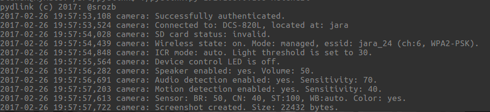
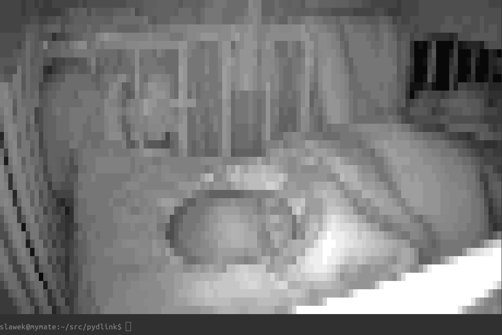

# pydlink
D-link DCS-820L (possibly other models too) babycam library - early stage/WIP.

**This is an ad-hoc code.**

## Requirements
1. Python2/3
2. python [fabulous](https://github.com/jart/fabulous) library

## Installation
`git clone` & `pip install -r requirements.txt`

## Usage
`./pydlink.py [host] [camera password]`

## Showcase
Getting basic info:

Render a frame to console:

